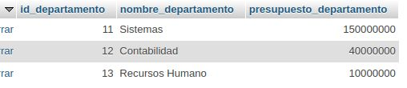
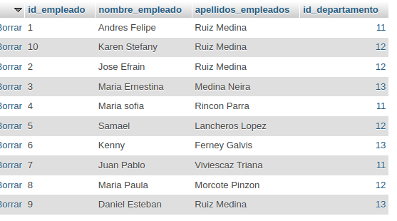
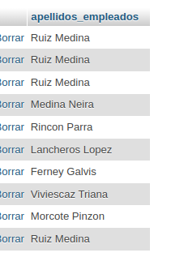
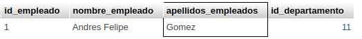
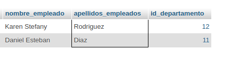
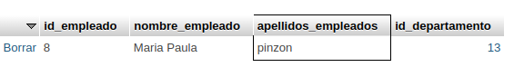
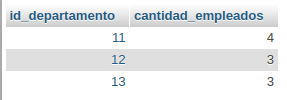
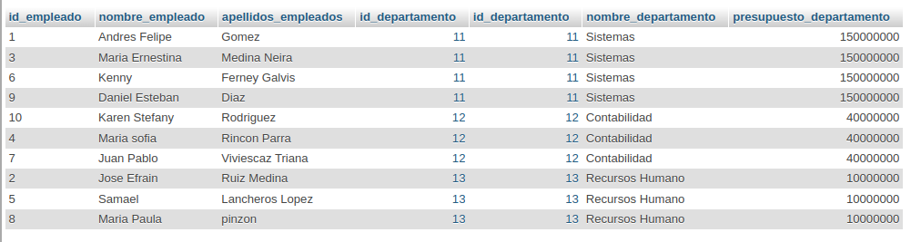
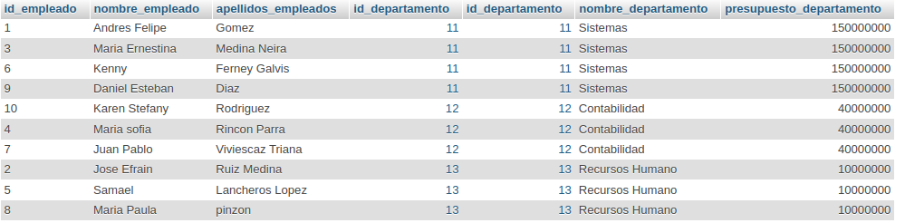
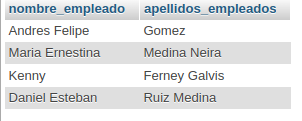

# Consulta2_sql

1. Obtener la lista de los apellidos de todos los empleados.

` SELECT apellidos_empleados FROM Empleados; `

2. Obtener la lista de los apellidos de todos los empleados.

` SELECT apellidos_empleados FROM Empleados; `

3. Obtener los apellidos de todos los empleados sin repeticiones.

`SELECT nombre_empleados FROM Empleado;`

4. Obtener todos los datos de los empleados que se apellidan 'Gomez'.

`SELECT * FROM Empleado WHERE apellidos_empleados = 'Gomez';`

5. Obtener todos los datos de los empleados que se apellidan "Diaz" y los que se apellidan "Rodriguez".  Usar OR o IN

`SELECT * FROM Empleado WHERE apellidos_empleados IN ('Diaz', 'Rodriguez');`

6. Obtener los nombres de los empleados que trabajan en el departamento 11

`SELECT nombre_empleado FROM Empleado WHERE id_departamento = 11;`

7. Obtener todos los datos de los empleados cuyo apellido empiece por 'P'

`SELECT * FROM Empleado WHERE apellidos_empleados LIKE 'P%';`

8. Obtener el presupuesto total de todos los departamentos.

`SELECT SUM(presupuesto_departamento) AS presupuesto_total FROM Departamento;`

9. Obtener el número de empleados de cada departamento.

`SELECT id_departamento, COUNT(*) AS cantidad_empleados FROM Empleado GROUP BY id_departamento;`

10. Obtener un listado completo de empleados, incluyendo por cada empleado los datos del empleado y de su departamento.

`SELECT * FROM Empleado e JOIN Departamento d ON e.id_departamento = d.id_departamento;`

11. Obtener un listado completo de empleados, incluyendo el nombre y apellidos del empleado junto al nombre y presupuesto de su departamento.

`SELECT Empleado.*, Departamento.* FROM Empleado JOIN Departamento ON Empleado.id_departamento = Departamento.id_departamento;`

12. Obtener los nombres y apellidos de los empleados que trabajen en departamentos cuyo presupuesto sea mayor a 100000000

`SELECT Empleado.nombre_empleado, Empleado.apellidos_empleados FROM Empleado JOIN Departamento ON Empleado.id_departamento = Departamento.id_departamento WHERE Departamento.presupuesto_departamento > 100000000;`

